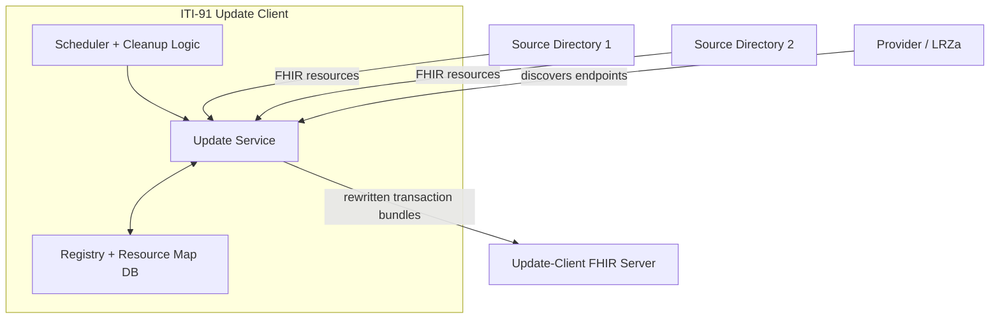

# ITI-91 Architecture

This document explains the architecture of the update client in this
repository. For startup and runtime configuration, use
[`../README.md`](../README.md) and
[`../../../start-stack/README.md`](../../../start-stack/README.md).

The service implements ITI-91-style update behavior for mCSD resources: it
polls source directories, rewrites source-local ids and references, and writes
the transformed resources into the configured update-client FHIR server.



## Core Flow

The service continuously synchronizes mCSD resources from one or more source
directories into the configured update-client FHIR server:

1. discover directory endpoints from config, file, and/or the registry database
2. fetch changed resources from each source directory
3. namespace source ids so multiple directories can coexist without collisions
4. rewrite internal references so they point at the local update-client FHIR
   server
5. order related resources and submit them as transaction bundles

The id and reference rewriting step is the core of the design. Source
directories can each use their own local logical ids, so the update client has
to namespace them before multiple directories can coexist safely in one target
store.

## Why Reference Rewriting Exists

Without rewriting, two different source directories could both contain a local
resource such as `Organization/1`. If both were copied into one aggregated
target store unchanged, they would collide.

The update client avoids that by namespacing ids per source directory and then
rewriting internal references to point at the corresponding namespaced target
resources.

Example input from a source directory:

```json
{
  "resourceType": "Organization",
  "id": "1",
  "name": "Good Health Clinic",
  "partOf": {
    "reference": "Organization/2"
  }
}
```

Conceptual shape after rewriting:

```json
{
  "resourceType": "Organization",
  "id": "directory-id-1",
  "name": "Good Health Clinic",
  "partOf": {
    "reference": "Organization/directory-id-2"
  }
}
```

The exact target id format is implementation-specific, but the design goal is
stable per-directory namespacing plus internally consistent rewritten
references.

## What The Service Stores

The code maintains local state for:

- directory metadata and health status
- ignored and deleted directory lifecycle flags
- resource-map entries that track synchronized source-to-target resources
- optional provider and provider-directory registry data

Those tables are what make the local admin endpoints and cleanup flows possible.
They are also what let the service remember lifecycle state across runs instead
of treating every sync as a stateless import.

In other words, the database is part of the behavior, not just a cache. It is
what lets the service remember:

- which providers were discovered or added manually
- which directories are currently ignored, unhealthy, or deleted
- which source resource became which target resource
- enough lifecycle state to support cleanup and reprocessing decisions

## Runtime Components

Update path:

- the update service polls each configured directory
- cache and HTTP retry layers reduce repeated lookups and transient failures
- best-effort handling allows PoC runs to continue when a source directory is
  imperfect rather than fully failing the whole process

That best-effort behavior is intentional. In this PoC, partial progress across
multiple directories is usually more useful than rejecting the entire update
cycle because one source is temporarily unhealthy or slightly non-conformant.

Polling behavior:

- the service fetches deltas from source directories rather than always doing a
  full import
- scheduler settings determine how often update and cleanup loops run
- capability and profile checks are configurable, and the shipped PoC config is
  intentionally tolerant rather than strict

Background control:

- the scheduler can start or stop background update runs
- cleanup logic removes or archives directories that have been deleted or stayed
  unhealthy for too long

API surface:

- health and version endpoints show service status
- directory endpoints expose the current known directory set and metrics
- registry endpoints allow provider refreshes and manual directory registration
- scheduler endpoints expose background-run control and runner history

## Discovery Inputs

The current code can source directory endpoints from multiple places:

- configured provider URLs
- a local directories file
- the directory-registry database

That is one of the main differences from a minimal reference implementation. In
this repo, directory discovery is part of the operational model, not just a
static config file.

## Scheduler And Lifecycle

Two background loops matter:

- the update scheduler, which keeps synchronizing directories
- the cleanup scheduler, which processes stale, ignored, and deleted directory
  lifecycle state

This means the service is continuously maintaining both:

- resource content in the target FHIR store
- directory lifecycle state in its own persistence layer

That lifecycle handling is what makes endpoints such as `/directory/health`,
`/directory/all`, and the ignore-list routes meaningful.

## Notes

- CapabilityStatement checks are configurable and are disabled in the shipped
  PoC config.
- The service can sync from multiple directories and multiple provider URLs.
- The current stack config uses the external test LRZa as a discovery source.
